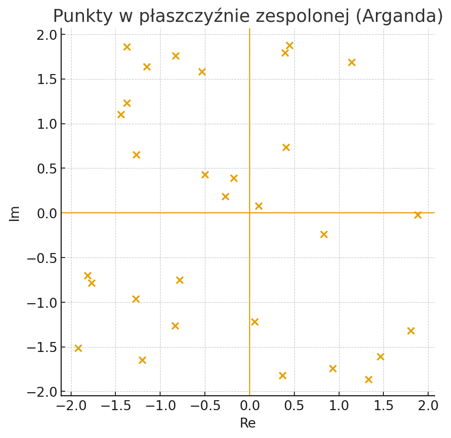
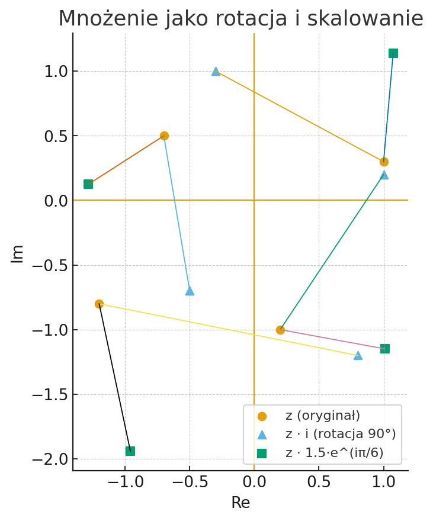
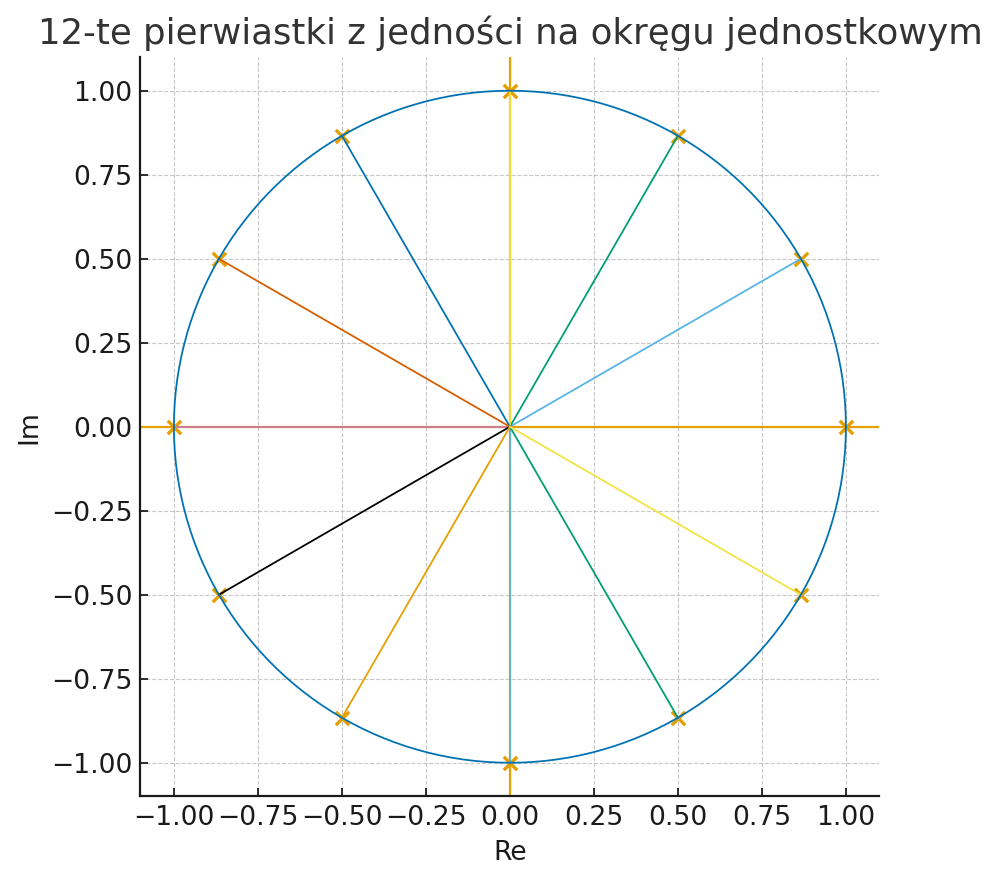

# Liczby zespolone i ich reprezentacja graficzna — poradnik w Pythonie

Repozytorium zawiera krótki **poradnik o liczbach zespolonych** oraz **notatnik Jupyter** z kodem i rysunkami ilustrującymi ich **reprezentację graficzną na płaszczyźnie zespolonej (Arganda)**.

> „Dobrze narysowana liczba zespolona mówi więcej niż akapit definicji.”

## Spis treści
- [Co to jest Jupyter Notebook?](#co-to-jest-jupyter-notebook)
- [Zawartość repozytorium](#zawartość-repozytorium)
- [Podgląd (rysunki)](#podgląd-rysunki)
- [Instalacja i uruchomienie](#instalacja-i-uruchomienie)
  - [Opcja A: Python + pip](#opcja-a-python--pip)
  - [Opcja B: Anaconda/Miniconda](#opcja-b-anacondaminiconda)
- [Jak korzystać z notatnika](#jak-korzystać-z-notatnika)
- [Porównanie sposobów uruchomienia (tabela)](#porównanie-sposobów-uruchomienia-tabela)
- [Struktura katalogów](#struktura-katalogów)
- [Licencja](#licencja)

## Co to jest Jupyter Notebook?
**Jupyter Notebook** to interaktywne środowisko łączące **kod**, **wyniki** i **opis** (Markdown) w jednym dokumencie `.ipynb`.  
Pozwala uruchamiać komórki z kodem krok po kroku, wizualizować wyniki (wykresy) i dodawać objaśnienia. To doskonały format do eksploracji danych, dydaktyki i replikowalnych eksperymentów.

- Plik notatnika: `complex_numbers_tutorial.ipynb`
- Technologie: Python 3, `numpy`, `matplotlib`
- Renderowanie wykresów odbywa się bezpośrednio w notatniku.

## Zawartość repozytorium
- `index.html` — strona startowa z podglądem rysunków oraz linkiem do pobrania notatnika.
- `complex_numbers_tutorial.ipynb` — notatnik Jupyter (Python, `numpy`, `matplotlib`).
- `img/` — wygenerowane obrazy:
  - `argand_scatter.png` — losowe punkty zespolone,
  - `rotation_demo.png` — mnożenie jako rotacja i skalowanie,
  - `roots_of_unity.png` — n-te pierwiastki z jedności.

## Podgląd (rysunki)




## Instalacja i uruchomienie

### Opcja A: Python + pip
> Minimalna, „lekka” instalacja.

```bash
# 1) (opcjonalnie) wirtualne środowisko
python -m venv .venv
# Windows
.venv\Scripts\activate
# macOS/Linux
source .venv/bin/activate

# 2) Zależności
pip install --upgrade pip
pip install jupyterlab numpy matplotlib

# 3) Uruchom
jupyter lab
# w interfejsie otwórz: complex_numbers_tutorial.ipynb
```

### Opcja B: Anaconda/Miniconda
> Wygodne środowisko „wszystko w jednym”. Polecane, jeśli zaczynasz lub chcesz szybciej zarządzać pakietami.

1. Pobierz i zainstaluj **Anaconda** lub **Miniconda**:  
   - Anaconda: <https://www.anaconda.com/download>
   - Miniconda: <https://docs.conda.io/en/latest/miniconda.html>
2. Utwórz środowisko i zainstaluj pakiety:
   ```bash
   conda create -n zespolone python=3.11 jupyterlab numpy matplotlib -y
   conda activate zespolone
   jupyter lab
   ```

## Jak korzystać z notatnika
- Uruchamiaj komórki po kolei (`Run`) i obserwuj wyniki.
- Zmieniaj parametry (np. kąt rotacji, zestaw punktów) i od razu sprawdzaj efekt.
- Przykłady obejmują:
  - **Podstawy**: część rzeczywista/urojona, moduł, argument, sprzężenie.
  - **Postać trygonometryczna** i wzór Eulera.
  - **Mnożenie jako rotacja i skalowanie** na płaszczyźnie zespolonej.
  - **n-te pierwiastki z jedności** na okręgu jednostkowym.

Lista zadań (dla prowadzenia dokumentacji postępu):
- [x] Przygotowanie notatnika i rysunków
- [x] Strona `index.html` z galerią
- [x] Rozszerzony `README.md` z tabelą i instrukcją Anaconda

## Porównanie sposobów uruchomienia (tabela)

| Kryterium | Python + pip | Anaconda/Miniconda |
|---|---|---|
| Szybkość startu | ✅ szybki | ⚠️ większa instalacja |
| Izolacja środowisk | ✅ wirtualne środowisko (`venv`) | ✅ środowiska `conda` |
| Wygoda zarządzania pakietami | dobra (pip) | bardzo dobra (conda) |
| Rozmiar instalacji | mały | większy |
| Dla początkujących | dobra | **bardzo dobra** |

> **Uwaga:** wybór zależy od preferencji i istniejącej konfiguracji. Jeśli nie masz jeszcze Pythona, Anaconda bywa najprostsza na start[¹].

[¹] *Miniconda* to lżejsza alternatywa Anacondy — instalujesz tylko to, czego potrzebujesz.

## Struktura katalogów
```
liczby-zespolone-poradnik-python/
├─ index.html
├─ complex_numbers_tutorial.ipynb
└─ img/
   ├─ argand_scatter.png
   ├─ rotation_demo.png
   └─ roots_of_unity.png
```

## Licencja
MIT
